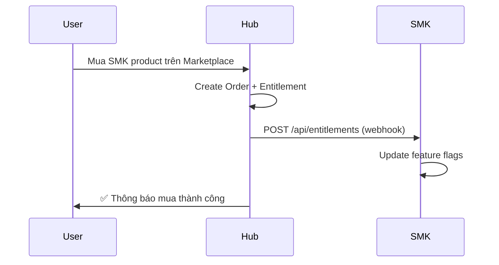

# eMarketer Hub

> 🚀 **Nền tảng SaaS marketplace** cho doanh nghiệp Việt Nam — CRM, Add-ons, AI tools

## Kiến trúc

```
eMarketer Hub (port 3000)
├── Landing Pages      /lp/[slug]          — Config-driven marketing pages
├── Hub Dashboard      /hub/               — Tổng quan, Marketplace, Billing
├── Marketplace        /hub/marketplace    — 18+ sản phẩm (CRM, add-ons, AI)
├── API Layer          /api/hub/           — Checkout, Wallet, Orders, Products
├── AI Services        /api/ai/            — Chat Widget, Lead Scoring, Content Gen
├── Analytics          /api/analytics/     — Event tracking pipeline
└── SMK Integration    Webhook → POST /api/entitlements
```

## Tích hợp SMK (Siêu Thị Mắt Kính)



### Flow chi tiết:
1. **SMK Upsell** → Nút "🛒 Mua trên Hub" link đến `/hub/marketplace/[slug]`
2. **Hub Checkout** → Debit ví → Create entitlement → Webhook to SMK
3. **SMK Sync** → `/api/entitlements` nhận POST → Bật feature flag

## Environment Variables

| Variable | Description |
|----------|-------------|
| `DATABASE_URL` | PostgreSQL connection string |
| `OPENAI_API_KEY` | OpenAI API key for AI features |
| `SMK_URL` | SMK server URL (default: `http://localhost:3001`) |
| `WEBHOOK_SECRET` | Shared secret for webhook auth |

## Dev Commands

```bash
npm run dev -- -p 3000     # Start dev server
npx tsc --noEmit           # TypeScript check
npm run build              # Production build
```

## Tech Stack

- **Framework**: Next.js 14 (App Router)
- **Database**: PostgreSQL + Prisma ORM
- **AI**: OpenAI GPT-4o / GPT-4o-mini
- **Auth**: JWT sessions + RBAC
- **Payments**: Wallet-based (credit-first debit)
