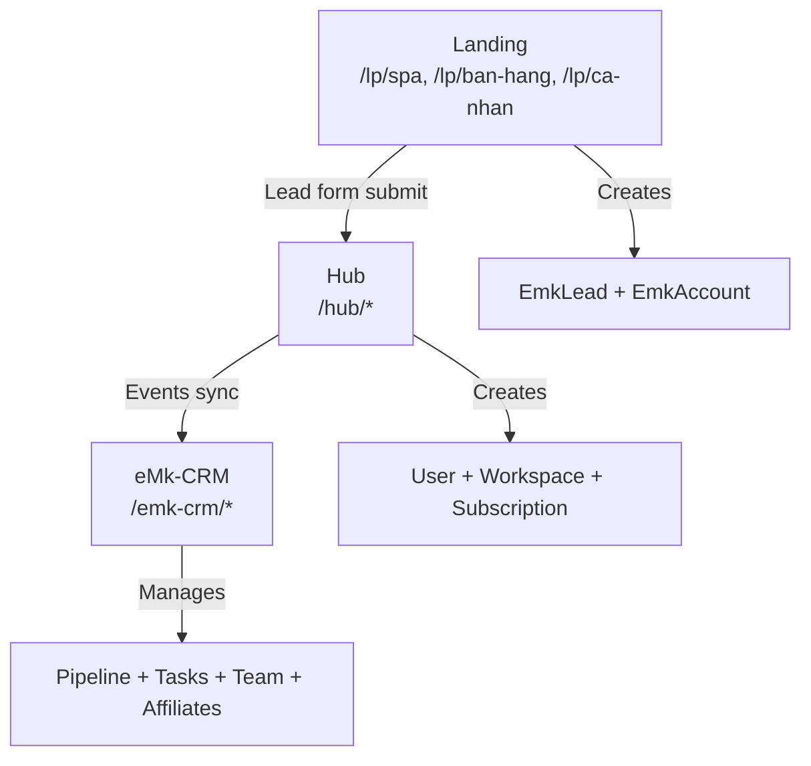

# eMarketer Platform – Architecture & Operations

## 3-Layer Architecture



### 1. Landing (Marketing Lead Gen)
- Config-driven templates at `/lp/[slug]`
- 3 industry: spa, ban-hang, ca-nhan
- Lead form → auto-provision Hub workspace

### 2. Hub (Customer Marketplace + Portal)
- `/hub` – Today dashboard
- `/hub/marketplace` – Outcome-based solutions
- `/hub/tasks` – Task inbox
- `/hub/billing` – Plan + invoices + payment proof
- `/hub/workspaces` – Workspace management
- `/hub/settings` – Profile, theme, security

### 3. eMk-CRM (Internal Ops)
- `/emk-crm` – Dashboard (KPIs, churn risk, tasks)
- `/emk-crm/leads` – Lead pipeline (8 stages)
- `/emk-crm/accounts` – Workspace/tenant mapping
- `/emk-crm/tasks` – Task queue by owner
- `/emk-crm/team` – Internal users (ADMIN/OPS/SALES/CS)
- `/emk-crm/affiliates` – Affiliate management
- `/emk-crm/payouts` – Commission batch + CSV
- `/emk-crm/logs` – Audit + error logs

---

## Lead → Hub Trial → CRM Pipeline Flow

1. **Ad click** → `/lp/spa`
2. **Lead form** → `POST /api/landing/submit`
3. **Auto-provision**: User + Org + Workspace + Trial(14d) + EmkLead + EmkAccount
4. **Redirect**: `/thank-you` → auto-login via token → `/hub`
5. **Hub events** → sync to eMk-CRM via `/api/emk-crm/ingest`
6. **CRM pipeline**: NEW → CONTACTED → ONBOARDING → ACTIVE → RENEWAL → AT_RISK → CHURNED/LOST

---

## Affiliate Attribution Rules

- **Attribution**: Last-click, 30-day window
- **Self-referral**: Blocked
- **Existing lead**: Not counted
- **Events**: AFF_CLICK → AFF_LEAD → AFF_TRIAL → AFF_PAID
- **Commission**: PENDING → APPROVED (after X days) → PAID
- **Payout**: Monthly batch, CSV export

---

## RBAC

| Route | Access | Roles |
|---|---|---|
| `/hub/*` | Customer | OWNER, ADMIN, STAFF (per workspace) |
| `/emk-crm/*` | eMarketer internal only | ADMIN, OPS, SALES, CS (User.emkRole) |

---

## Data Models (Key)

| Domain | Models |
|---|---|
| Auth | User, UserSetting, Org, Workspace, Membership |
| Hub Commerce | Product, Plan, Subscription, UpgradeOrder, PaymentProof, PaymentTxn |
| eMk-CRM | EmkLead, EmkAccount, EmkTask, EmkNote |
| Affiliate | AffiliateAccount, AffiliateLink, Referral, Commission, PayoutBatch, PayoutItem |
| Logging | EventLog, ErrorLog |

---

## Seed Demo Account

```bash
# Set existing user as eMarketer staff
npx prisma studio --schema=prisma/platform/schema.prisma
# → User table → find admin → set emkRole = "ADMIN"
```

---

## QA Checklist (30 cases)

### Landing (5 cases)
1. [ ] `/lp/spa` renders hero + features + form
2. [ ] Lead form: name + phone required validation
3. [ ] Honeypot hidden, doesn't submit if filled
4. [ ] Form submit → redirect `/thank-you` with token
5. [ ] Auto-redirect to Hub via token-login

### Hub (10 cases)
6. [ ] `/hub` shows today dashboard + coach card
7. [ ] `/hub/marketplace` lists products with filter
8. [ ] `/hub/marketplace/[slug]` product detail + CTA
9. [ ] `/hub/tasks` add + complete tasks
10. [ ] `/hub/billing` shows plan + invoices
11. [ ] `/hub/billing` upload payment proof
12. [ ] `/hub/workspaces` shows workspace list
13. [ ] `/hub/settings` profile + theme + security
14. [ ] Bottom nav 5 tabs responsive
15. [ ] Trial banner shows countdown

### eMk-CRM (10 cases)
16. [ ] `/emk-crm` dashboard KPIs load
17. [ ] `/emk-crm/leads` list + filter by status
18. [ ] Leads: change status inline
19. [ ] `/emk-crm/accounts` shows workspaces
20. [ ] `/emk-crm/tasks` add + complete
21. [ ] `/emk-crm/team` change role + remove
22. [ ] `/emk-crm/affiliates` add affiliate + view links
23. [ ] `/emk-crm/payouts` create batch
24. [ ] `/emk-crm/logs` events + errors tabs
25. [ ] Non-emkRole user gets 403 on /emk-crm APIs

### Cross-flow (5 cases)
26. [ ] Landing submit → EmkLead created
27. [ ] Landing submit → EmkAccount created
28. [ ] Hub signup → workspace + trial subscription
29. [ ] Token login → sets session cookie
30. [ ] Theme toggle persists across pages
